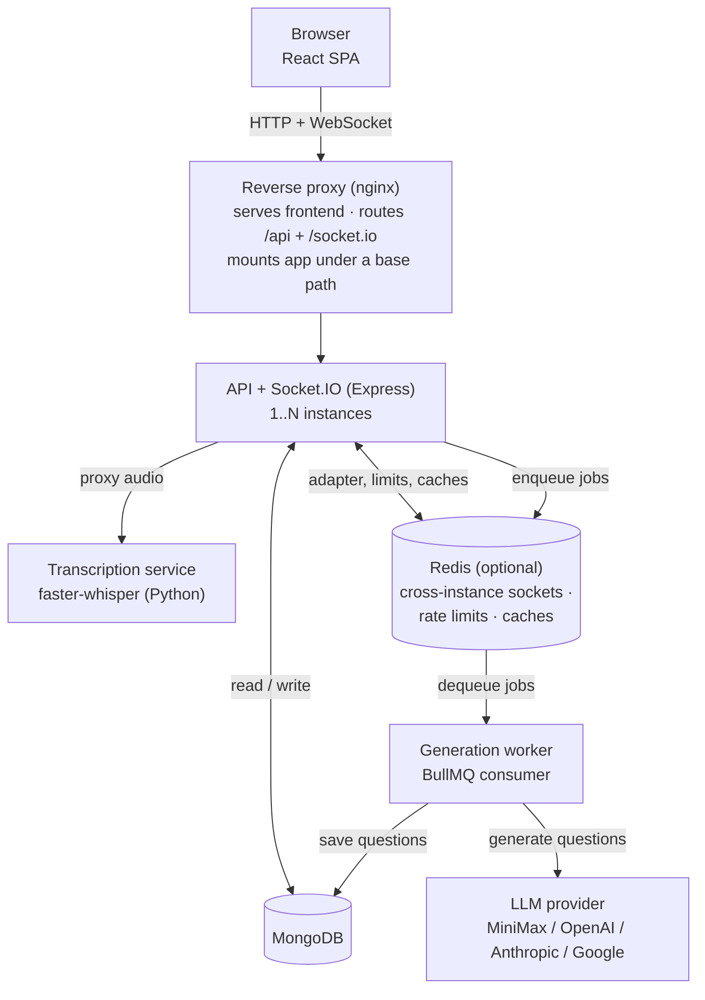

# Spandan

> Real-time classroom polling with LLM-generated questions from the live lecture transcript.

Spandan is a web platform for running live, interactive polls in classrooms and
presentations. A teacher speaks, or plays a YouTube video or live stream to the
room; that audio is transcribed; a large language model generates poll questions
from that transcript; the teacher approves them; students answer live on their
own devices; and the room sees results and a leaderboard update in real time.
The goal is to keep large classes engaged with low-friction, in-the-moment
questions rather than after-the-fact quizzes.

## Contents

- [Features](#features)
- [Architecture](#architecture)
- [Tech stack](#tech-stack)
- [Getting started](#getting-started)
- [Configuration](#configuration)
- [Running the optional services](#running-the-optional-services)
- [Testing](#testing)
- [Deployment](#deployment)
- [API overview](#api-overview)
- [Project structure](#project-structure)
- [Roles](#roles)
- [Contributing](#contributing)
- [License](#license)

## Features

- **Authentication** — email/password login with JWT, "Sign in with Google"
  (OAuth 2.0), email-OTP registration, and password reset by email.
- **Rooms** — teachers create rooms; students join by code; owners manage the
  room lifecycle and the live question flow.
- **Video Mode** — a room can be built around a YouTube video or live stream
  instead of a spoken lecture. Students watch it in a synchronised in-app player
  that they cannot seek ahead in, and their playback pauses for the whole
  question window; the video's audio is captured on the teacher's tab and
  transcribed, so question generation works exactly as it does for a live
  lecture. (Tab-audio capture needs Chrome or Edge.)
- **Live polling** — multiple-choice, true/false, and multi-select questions
  pushed to students in real time over Socket.IO, with a per-poll response
  window. The mix of the three types is a per-room setting.
- **LLM question generation** — poll questions are generated by a large language
  model from the lecture transcript, with a teacher approval step before they go
  live. Multiple providers are supported (MiniMax, OpenAI, Anthropic, Google) via
  a configurable API key.
- **Transcription** — a separate faster-whisper service turns lecture audio into
  the transcript that drives question generation.
- **Live results & leaderboard** — response counts stream in as students answer,
  and a ranked leaderboard updates per question segment. A room can also run an
  **anonymous leaderboard**: students then see a masked top-N board only
  (`Anonymous #<rank>`, with no way to locate themselves), while the teacher
  still sees the real names of the lowest-scoring slice of the class (a
  configurable percentage) and can optionally reveal that same slice to
  students. Masking happens on the server, so hidden names never reach the
  browser.
- **Roles** — Teacher, Student, and Admin (Admin approves teacher-access
  requests).
- **Session export** — a key-protected endpoint (`X-Research-Key`) exports the
  results of ended sessions. Student names and email addresses are included by
  design: a companion lab app consumes the export to award students points for
  their poll answers and participation. The export therefore carries PII and
  must be covered by the relevant consent and data-sharing agreement.
- **Theming & responsive UI** — dark/light themes; works across desktop and
  mobile.

## Architecture

Spandan runs as a small set of cooperating processes rather than a single server
(diagram renders on GitHub and any Mermaid-enabled Markdown viewer):



- **API server** (`backend/src/index.js`) — REST API + Socket.IO for live events.
  Can run as multiple instances; when a `REDIS_URL` is configured the Socket.IO
  Redis adapter, cross-instance rate limiting, and shared live caches are enabled
  so instances stay in sync.
- **Generation worker** (`backend/src/worker.js`) — a BullMQ consumer that runs
  LLM question generation off the API's request path, so slow model calls never
  tie up API connections. Requires Redis.
- **Transcription service** (`backend/transcription_server.py`) — a standalone
  faster-whisper server, written in Python, that the API proxies audio to (port
  `3003` by default) so speech-to-text inference never blocks the Node event
  loop. An earlier Node implementation (`backend/src/transcriptionServer.js`,
  Xenova Whisper on port `3002`) is still in the tree but is not what the
  deployment runs.
- **Frontend** (`frontend/`) — a React single-page app built with Vite. In
  production the built assets are served behind the reverse proxy under a base
  path (e.g. `/spandan`); in local development the Vite dev server proxies API
  and socket traffic to the backend.

Redis, the worker, and the transcription service are all optional for a minimal
local setup — see [Running the optional services](#running-the-optional-services).

## Tech stack

| Layer | Technologies |
|-------|-------------|
| **Frontend** | React, Vite, TailwindCSS, Zustand, React Router, Socket.IO client |
| **Backend** | Node.js, Express, Socket.IO, Mongoose (MongoDB), Zod, Helmet, express-rate-limit |
| **Auth** | JWT, bcrypt, Google OAuth 2.0 |
| **Async / scale** | Redis, BullMQ (generation queue), Socket.IO Redis adapter |
| **LLM question generation** | Pluggable provider — MiniMax, OpenAI, Anthropic, or Google |
| **Transcription** | faster-whisper (Python), standalone STT service the API proxies to |
| **Email** | Pluggable provider — Brevo (default), Resend or SendGrid over HTTPS, or Gmail SMTP via Nodemailer |
| **Testing / CI** | Jest, supertest, in-memory MongoDB, GitHub Actions |

## Getting started

### Prerequisites

- **Node.js 20+** and npm
- **MongoDB** running locally (or a connection string to a remote instance)
- **Redis** — optional; only needed for the generation worker and multi-instance
  mode
- **Python 3** — optional; only needed to run the transcription service

### Install

This is an npm-workspaces monorepo (`frontend` + `backend`). Install everything
from the repo root:

```bash
npm run install:all
```

### Configure

Copy the backend environment template and fill in the values you need:

```bash
cp backend/.env.example backend/.env
```

For a minimal local run you typically only set `MONGODB_URI`, `JWT_SECRET`, and
(if you want question generation) one AI provider key. The template documents
every variable and its default — see [Configuration](#configuration).

The frontend has its own small template:

```bash
cp frontend/.env.example frontend/.env
```

That template ships `VITE_BASE_PATH=/spandan`, the value for a proxied
production deployment. **For local development set it to empty**
(`VITE_BASE_PATH=`) — otherwise the dev server serves the app at
`http://localhost:5173/spandan/` instead of the root URL below.

### Run (local development)

From the repo root, start the frontend and backend together:

```bash
npm run dev
```

- Frontend (Vite dev server): **http://localhost:5173**
- Backend API: **http://localhost:3001** (the Vite dev server proxies `/api` and
  `/socket.io` to it)

That is enough to log in and, once you have an approved teacher account (see
below), create rooms and run manual polls. Question generation and audio
transcription need the optional services further down.

### First admin and teacher approval

Teacher accounts register with approval status `pending` and cannot create rooms
or run polls until an admin approves them, so a fresh install needs an admin to
exist first. Admins are identified by a persisted `isAdmin` flag **or** by a
bootstrap allowlist, which is what lets the very first admin act before any flag
is set in the database:

```bash
# backend/.env
SPANDAN_ADMIN_EMAILS=you@example.com,colleague@example.com
```

Register normally with one of those addresses, sign in, and the admin page lists
the pending teacher requests to approve or reject. Students need no approval.

For an existing deployment that predates this feature,
`backend/scripts/migrate_teacher_approval.js` backfills the approval field. It
is a dry run by default and only writes with `--apply`.

## Configuration

The backend is configured entirely through environment variables. The canonical,
fully-commented list lives in **`backend/.env.example`** — treat that file as the
source of truth. The variables you will most often set:

| Variable | Purpose |
|----------|---------|
| `PORT` | API listen port (local dev default `3001`) |
| `NODE_ENV` | `production` gates off verbose logging and hides error detail |
| `MONGODB_URI` | MongoDB connection string |
| `JWT_SECRET` | Secret for signing login tokens (use a strong random value) |
| `FRONTEND_URL` / `CORS_ORIGINS` | Allowed origins and email/link base URL |
| `REDIS_URL` | Enables the worker + multi-instance mode (leave empty for single instance) |
| One of `MINIMAX_API_KEY` / `OPENAI_API_KEY` / `ANTHROPIC_API_KEY` / `GOOGLE_API_KEY` | AI provider for question generation |
| `EMAIL_PROVIDER` | Outbound email provider: `brevo` (default), `resend`, `sendgrid`, or `smtp` |
| `EMAIL_API_KEY` / `MAIL_FROM` | API key for the chosen HTTP provider, and the verified sender address |
| `SMTP_EMAIL` / `SMTP_PASSWORD` | Gmail credentials — used only when `EMAIL_PROVIDER=smtp` |
| `GOOGLE_OAUTH_CLIENT_ID` / `_SECRET` / `_REDIRECT_URI` | "Sign in with Google" (feature stays off until all three are set) |
| `TRANSCRIPTION_SERVICE_URL` | Where the API proxies audio for transcription |
| `RESEARCH_API_KEY` | Protects the session-export endpoint (required in production) |
| `SPANDAN_ADMIN_EMAILS` | Comma-separated bootstrap admin allowlist — needed to approve the first teacher |

Outbound email defaults to an HTTP provider (port 443) because many cloud hosts
— the production droplet included — block outbound SMTP; set
`EMAIL_PROVIDER=smtp` only where SMTP ports are open.

Many additional variables tune caches, live-update throttling, the leaderboard,
and response buffering; all are optional and documented in the template.

The frontend uses `VITE_BASE_PATH` (empty for local dev, a path like `/spandan`
for a proxied production deployment) and an optional `VITE_SOCKET_URL` override.

## Running the optional services

**Generation worker** (needs `REDIS_URL` set):

```bash
npm run worker --workspace=backend
```

**Transcription service** (standalone faster-whisper server in Python; the API
proxies to it via `TRANSCRIPTION_SERVICE_URL`):

```bash
pip3 install -r backend/requirements.txt
python3 backend/transcription_server.py   # or: bash backend/start_transcription.sh
```

It listens on `TRANSCRIPTION_PORT` (default `3003`) and answers `GET /health`
with the loaded model. Keep `TRANSCRIPTION_SERVICE_URL` pointed at the same port
— the backend default is `http://127.0.0.1:3003`. The model, device and compute
type are tunable with `TRANSCRIPTION_MODEL` (default `base`),
`TRANSCRIPTION_DEVICE` (`cpu`, or `cuda` on a GPU box) and `TRANSCRIPTION_COMPUTE`
(`int8`).

## Testing

Backend and frontend each have a Jest suite. The backend tests run against an
in-memory MongoDB, so no database or secrets are required.

```bash
# Backend (from repo root)
npm test --workspace=backend

# Frontend
npm test --workspace=frontend
```

GitHub Actions runs both suites on every push and pull request to `main`.

## Deployment

Production runs the built frontend and the API behind nginx, with the app
mounted under a base path (the reference deployment uses `/spandan`).

### 1. Environment

Set `NODE_ENV=production` and production values for `JWT_SECRET`, `MONGODB_URI`,
`CORS_ORIGINS`/`FRONTEND_URL` (include the base path), an AI provider key, the
email provider settings, `RESEARCH_API_KEY`, and `SPANDAN_ADMIN_EMAILS` for the
first admin. MongoDB must be reachable; Redis is required only for the
generation worker and multi-instance mode.

### 2. Build the frontend

`VITE_BASE_PATH` is baked in at build time, so it must be set **before** the
build, in `frontend/.env` or the shell:

```bash
VITE_BASE_PATH=/spandan npm run build
```

The build writes to **`dist/` at the repository root**, which is what nginx
serves.

### 3. nginx

Serve the built assets and forward the API and websocket traffic to the backend.
With a single instance:

```nginx
location /spandan/ {
    alias /var/www/spandan/dist/;
    try_files $uri $uri/ /spandan/index.html;
}

location /spandan/api/ {
    proxy_pass http://127.0.0.1:7001/api/;
    proxy_set_header Host $host;
    proxy_set_header X-Real-IP $remote_addr;
    proxy_set_header X-Forwarded-For $proxy_add_x_forwarded_for;
    proxy_set_header X-Forwarded-Proto $scheme;
}

location /spandan/socket.io/ {
    proxy_pass http://127.0.0.1:7001/socket.io/;
    proxy_http_version 1.1;
    proxy_set_header Upgrade $http_upgrade;
    proxy_set_header Connection "upgrade";
    proxy_set_header Host $host;
}
```

For **two or more API instances**, put them behind a sticky upstream — a
client's polling handshake and its websocket must reach the same instance — and
`proxy_pass` to it instead of a single port:

```nginx
upstream spandan_backend {
    ip_hash;
    server 127.0.0.1:7001;
    server 127.0.0.1:7002;   # one line per instance
}
```

`nginx/spandan.fun.conf` in this repo is a separate vhost: it serves the public
landing page in `html/` for the project's own domain, not the app itself.

### 4. Long-lived processes

- **API** — run one or more instances under pm2, each on its own `PORT` (the
  reference deployment runs two, on `7001` and `7002`). More than one instance
  requires `REDIS_URL` so Socket.IO events reach clients on every instance.
- **Generation worker** — `backend/src/worker.js`, needed only when Redis is
  enabled; without Redis the API generates questions synchronously.
- **Transcription service** — `backend/transcription_server.py` on port `3003`,
  with `pip3 install -r backend/requirements.txt` first.

`backend/spandan-worker.service` and `backend/spandan-transcription.service` are
systemd units for the last two. They ship with the paths and `User=` of an older
host, so adjust both before installing.

### 5. Shipping updates

**`.github/workflows/deploy-do.yml`** is a manually triggered
(`workflow_dispatch`) job, run from the Actions tab: it connects to the server
over SSH, pulls `main`, installs the workspace dependencies, rebuilds the
frontend, and restarts the pm2 processes. By hand the same steps are:

```bash
git pull origin main
npm install
npm run build
npx pm2 restart all --update-env
```

## API overview

All routes are mounted under `/api`. High-level grouping:

| Route group | Responsibility |
|-------------|----------------|
| `/api/auth` | Register (OTP), login, Google OAuth, profile, password reset |
| `/api/rooms` | Create/list/manage rooms; join by code; student room history |
| `/api/questions` | List providers, generate questions, poll job status, approve |
| `/api/responses` | Submit answers, per-student/per-room stats, counts, leaderboard, export |
| `/api/transcription` | Proxy audio to the transcription service; status |
| `/api/transcripts` | Store and fetch lecture transcript segments |
| `/api/research` | Key-protected export of ended-session results (feeds the points award in a companion lab app) |
| `/api/admin` | Review and approve/reject teacher-access requests |

## Project structure

```
spandan/
├── frontend/                 # React app (Vite)
│   └── src/
│       ├── main.jsx  App.jsx   # Entry point and root component
│       ├── components/        # UI components
│       ├── pages/             # Route pages (auth, dashboard, rooms, admin, ...)
│       ├── stores/            # Zustand stores
│       ├── services/          # API + socket clients
│       ├── hooks/  lib/        # Shared hooks and helpers
│       ├── config.js          # Base path / socket URL config
│       └── __tests__/         # Frontend tests
├── backend/                  # Express API + Socket.IO
│   ├── src/
│   │   ├── index.js           # API server entry point
│   │   ├── config.js          # Env-backed app config (email, AI providers, ...)
│   │   ├── worker.js          # BullMQ generation worker
│   │   ├── transcriptionServer.js  # Legacy Node STT service (superseded)
│   │   ├── routes/            # HTTP route handlers
│   │   ├── services/          # Business logic (rooms, questions, leaderboard, ...)
│   │   ├── models/            # Mongoose schemas
│   │   ├── middleware/        # Auth + validation
│   │   ├── config/            # Redis and other config
│   │   ├── utils/             # Shared helpers
│   │   └── __tests__/         # Backend tests
│   ├── transcription_server.py  # faster-whisper STT service (the one in use)
│   ├── requirements.txt      # Python deps for it
│   ├── scripts/              # One-off migrations
│   └── *.service             # systemd units (worker, transcription)
├── nginx/                    # Landing-page vhost for the project domain
├── html/                     # Static landing page served by that vhost
├── .github/workflows/        # CI + manual deploy
├── Spandan_Version_MDs/      # Per-version build specs
├── package.json              # Monorepo root (npm workspaces)
└── README.md
```

## Roles

| Role | Capabilities |
|------|-------------|
| **Student** | Join rooms, answer live polls, view own history and results |
| **Teacher** | Create/manage rooms, generate and approve questions, run polls, view results and leaderboard |
| **Admin** | Everything a teacher can do, plus review and approve/reject teacher-access requests |

## Contributing

Contributions are welcome.

1. **Fork and branch** — create a feature branch off `main`
   (`git checkout -b feat/short-description`).
2. **Set up locally** — follow [Getting started](#getting-started); copy the
   `.env.example` files and run `npm run dev`.
3. **Make focused changes** — keep pull requests small and scoped to one concern.
   Match the existing code style (ES modules on the backend, functional React
   components on the frontend).
4. **Add or update tests** — the backend uses an in-memory MongoDB, so tests run
   without external services. Please cover new behaviour.
5. **Run the suites locally** before opening a PR:
   ```bash
   npm test --workspace=backend
   npm test --workspace=frontend
   ```
6. **Open a pull request** against `main`. CI runs both test suites on every PR;
   the checks should pass before review.

`Spandan_Version_MDs/` holds a per-version build spec for the whole series, and
is the quickest way to see how a feature reached its current shape.

For bugs and feature ideas, open an issue describing the problem, the steps to
reproduce, and what you expected to happen.

## License

Released under the MIT License. See [LICENSE](LICENSE) for details.
